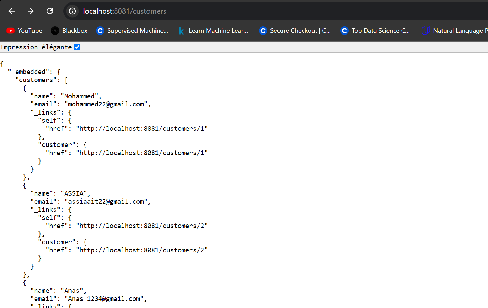
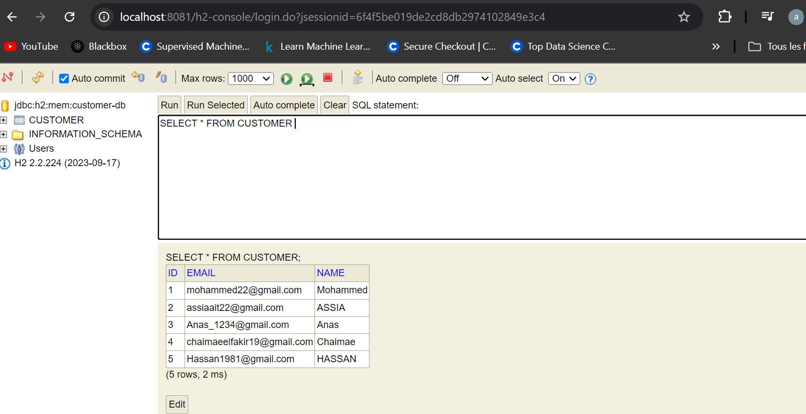
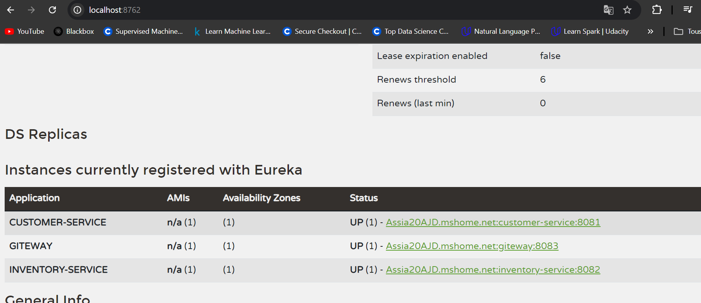
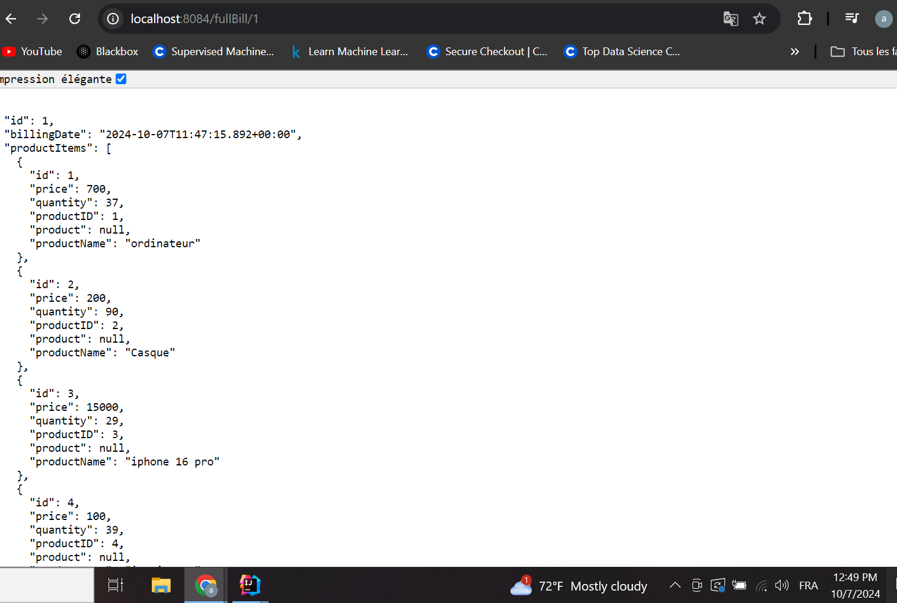
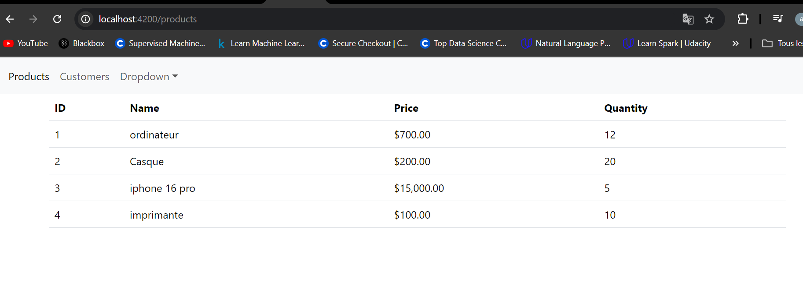
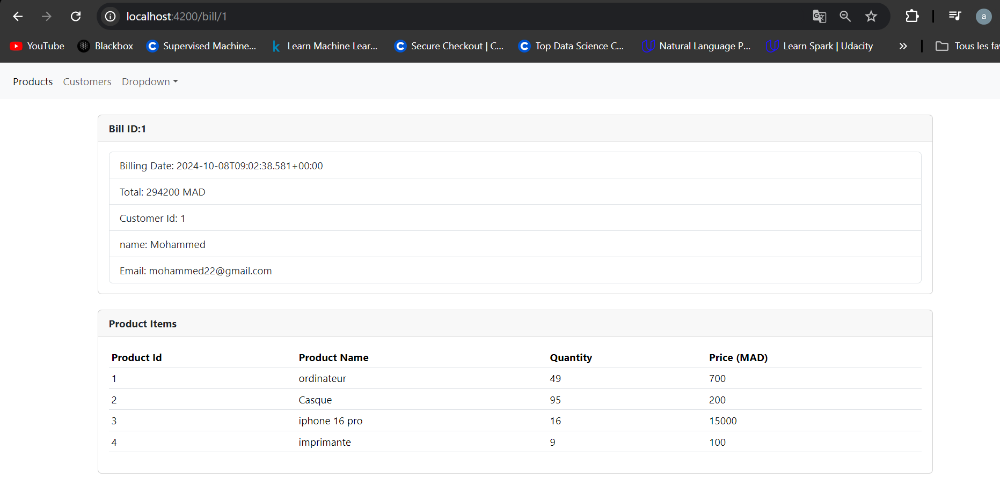

<h1>Activit Pratique N2 : Mise en oeuvre d'une architecture micro services</h1>

## Description

Ce projet vise à démontrer la mise en œuvre d'une architecture micro-services en utilisant Spring Boot, Angular, et d'autres technologies pertinentes. 
Il comprend la gestion de factures, des clients, et des produits à travers divers micro-services.

## Technologies Utilisées

### Backend :
  - Spring Boot 
  - Spring Cloud 
  - Spring Data JPA 
  - Eureka  
  - H2/MySQL (base de données) 
  - Feign Client pour la communication entre micro-services 

### Frontend :
  - Angular
  - Bootstrap

## Structure du Projet

- **billing-service**: Micro-service pour la gestion des factures.
  - Responsabilité: Création, mise à jour, et récupération des factures.
  
- **customer-service**: Micro-service pour la gestion des clients.
  - Responsabilité: Gestion des informations des clients, y compris la création et la mise à jour des profils clients.

- **product-service**: Micro-service pour la gestion des produits.
  - Responsabilité: Gestion des informations sur les produits, y compris l'ajout, la mise à jour, et la suppression des produits.

- **gateway**: Point d'entrée unique pour toutes les requêtes. Gère le routage des requêtes vers les services appropriés.
  
- **Eureka Discovery**: Service de découverte qui permet aux micro-services de se trouver et de communiquer entre eux facilement.

